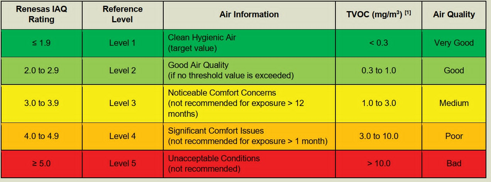

# Air-Quality-Monitoring-System — Edge AI

Real-time indoor air quality monitoring system using **Renesas CK-RA6M5** as the sensor node, **ESP32** as the IoT gateway, and a **FastAPI** backend with Edge AI 5-minute prediction capabilities.

> **Institution:** Ho Chi Minh City University of Technology (HCMUT) — Course EE3031

---

## Demo Video

### Demo 1 — Dữ liệu thực từ kit CK-RA6M5 + ESP32

<video src="https://github.com/user-attachments/assets/ca7bc232-f19c-4947-a9d0-aea99755fea5" controls width="100%"></video>

### Demo 2 — Dữ liệu giả lập (Mock Data Simulator)

<video src="https://github.com/user-attachments/assets/a8428efd-935d-4e82-974f-c988e2f8d04f" controls width="100%"></video>

---

## Architecture

```
CK-RA6M5 (Sensor Node)          ESP32 (Gateway)          PC / Server (Backend)
┌─────────────────────┐          ┌─────────────┐          ┌──────────────────────┐
│ ZMOD4410 — IAQ/VOC  │  UART    │             │WebSocket │   FastAPI + Uvicorn  │
│ HS3001   — Temp/Hum │─────────▶│  main.cpp   │─────────▶│   /ws/ingest         │
│ Edge AI  — Predict  │115200bps │  PlatformIO │          │   SQLite WAL DB      │
└─────────────────────┘          └─────────────┘          │   /ws/realtime       │
                                                           └──────────┬───────────┘
                                                                      │ WebSocket broadcast
                                                                      ▼
                                                           ┌──────────────────────┐
                                                           │  Dashboard           │
                                                           │  http://localhost:8000│
                                                           │  Chart.js · Dark/Light│
                                                           └──────────────────────┘
```

---

## Features

- **Real-time monitoring** — IAQ, TVOC, eCO₂, eToH, Temperature, Humidity qua WebSocket (~1 Hz)
- **5-minute AI prediction** — Edge AI model chạy trên CK-RA6M5, dự báo IAQ 5 phút tới
- **Renesas 5-level IAQ rating** — thang đánh giá chuẩn Renesas ZMOD4410
- **Interactive dashboard** — live charts, donut gauges, trend indicators, event log, dark/light theme
- **Alert engine** — 3 mức severity: Critical / Warning / Info, cooldown 30 giây
- **Data history** — 1h / 24h / 7d / 30d với downsampling tự động
- **Device status** — Online / Warning / Offline detection theo timeout (10s / 30s)
- **Docker support** — chạy toàn bộ stack chỉ với `docker compose up --build`

---

## Renesas IAQ Rating Scale



> Bảng thang đánh giá IAQ chuẩn Renesas ZMOD4410 — nguồn: Renesas Application Note R19AN0088

| IAQ Rating | Level | Air Quality | TVOC (mg/m³) | Ghi chú |
|:---:|:---:|:---:|:---:|:---|
| ≤ 1.9 | Level 1 | Rất tốt (Very Good) | < 0.3 | Clean Hygienic Air — target value |
| 2.0–2.9 | Level 2 | Tốt (Good) | 0.3–1.0 | Good Air Quality |
| 3.0–3.9 | Level 3 | Trung bình (Medium) | 1.0–3.0 | Không khuyến nghị tiếp xúc > 12 tháng |
| 4.0–4.9 | Level 4 | Kém (Poor) | 3.0–10.0 | Không khuyến nghị tiếp xúc > 1 tháng |
| ≥ 5.0 | Level 5 | Rất kém (Bad) | > 10.0 | Unacceptable Conditions |

---

## Monitored Metrics

| Metric | Unit | Range | Sensor |
|---|---|---|---|
| IAQ Index | — | 1.0–5.0+ | ZMOD4410 (Edge AI) |
| TVOC | mg/m³ | 0–15 | ZMOD4410 |
| eCO₂ | ppm | 400–5000 | ZMOD4410 |
| eToH (Ethanol) | mg/m³ | 0–0.5 | ZMOD4410 |
| Temperature | °C | −20 to 80 | HS3001 |
| Humidity | %RH | 0–100 | HS3001 |
| Predicted IAQ (5 min) | — | 1.0–6.0 | Edge AI on CK-RA6M5 |

---

## Project Structure

```
Air-Quality-Monitoring-System-Edge-AI-/
├── app/                        # FastAPI backend
│   ├── main.py                 # Entry point — mounts frontend, registers routes
│   ├── config.py               # Ngưỡng cảnh báo & DB path (env-aware)
│   ├── schemas.py              # Pydantic validation (SensorPayload, 21 fields)
│   ├── database.py             # SQLite async + WAL + migration
│   ├── crud.py                 # DB operations (insert, upsert, query)
│   ├── api_routes.py           # REST: /health /current /history /status /logs
│   ├── alert_engine.py         # Threshold check + event_logs (30s cooldown)
│   ├── status_monitor.py       # Online/Warning/Offline background task
│   ├── websocket_ingest.py     # /ws/ingest — nhận dữ liệu từ ESP32
│   ├── connections.py          # ConnectionManager — broadcast đến dashboard
│   └── websocket_realtime.py   # /ws/realtime — stream đến dashboard
├── js/                         # Frontend JavaScript
│   ├── app.js                  # WebSocket orchestrator & fetch API
│   ├── charts.js               # Chart.js 4.4 — IAQ, TVOC, eCO₂, Env charts
│   ├── ui.js                   # DOM updates — badges, gauges, alert table
│   └── mock.js                 # Mock data fallback (khi mất kết nối)
├── css/
│   └── style.css               # Dashboard styling — dark/light theme, responsive
├── simulator/
│   └── send_mock_data.py       # Giả lập ESP32 — gửi data vào /ws/ingest
├── test/
│   └── run_tests.py            # 10 test cases (TC01–TC10)
├── docs/
│   └── renesas_iaq_table.png   # Bảng thang IAQ Renesas
├── data/                       # SQLite database (auto-created, volume-mounted)
├── index.html                  # Dashboard HTML
├── logo.png                    # HCMUT logo
├── Dockerfile                  # Multi-stage build (builder + runtime)
├── docker-compose.yml          # Volume + healthcheck + env
├── .dockerignore
├── requirements.txt
└── start_server.bat            # Windows quick-start (auto-restart)
```

---

## Tech Stack

| Layer | Technology |
|---|---|
| Sensor Node | Renesas CK-RA6M5, ZMOD4410 (IAQ/VOC/eToH), HS3001 (Temp/Hum), FSP + e2 Studio |
| IoT Gateway | ESP32 DevKit, PlatformIO, ArduinoJson, WebSockets library |
| Backend | Python 3.11, FastAPI 0.111, Uvicorn 0.29, Pydantic v2.7 |
| Database | SQLite + aiosqlite (WAL mode, 3 tables, indexes) |
| Real-time | WebSockets — dual channel: `/ws/ingest` (ESP32→Server) + `/ws/realtime` (Server→Dashboard) |
| Frontend | HTML5, Vanilla JS, Chart.js 4.4 — served trực tiếp bởi FastAPI |
| Container | Docker (multi-stage), Docker Compose |

---

## Quick Start

### Docker (recommended)

```cmd
docker compose up --build
```

Mở trình duyệt: **http://localhost:8000**

Lần sau (không cần rebuild):
```cmd
docker compose up
```

### Python thủ công (Windows)

```cmd
py -3.11 -m venv .venv
.venv\Scripts\activate
pip install -r requirements.txt
uvicorn app.main:app --host 0.0.0.0 --port 8000
```

Mở trình duyệt: **http://localhost:8000**

### Simulator (không cần phần cứng)

```cmd
python simulator/send_mock_data.py --url ws://localhost:8000/ws/ingest
```

---

## API Endpoints

| Endpoint | Method | Description |
|---|---|---|
| `/health` | GET | Server health check |
| `/api/current` | GET | Latest sensor reading + device status |
| `/api/history` | GET | Historical data (`?range=1h\|24h\|7d\|30d&metric=iaq_index`) |
| `/api/status` | GET | Device online/offline status |
| `/api/logs` | GET | Event logs (`?limit=50&severity=critical\|warning\|info`) |
| `/ws/ingest` | WS | ESP32/Simulator → Server ingestion |
| `/ws/realtime` | WS | Server → Dashboard live stream |
| `/docs` | GET | Auto-generated Swagger UI |

---

## Hardware Connections

| ESP32 Pin | Direction | CK-RA6M5 Pin | Note |
|:---:|:---:|:---:|:---|
| GPIO16 (RX2) | ← | P707 (UART3 TX) | Nhận dữ liệu từ RA6M5 |
| GPIO17 (TX2) | → | P706 (UART3 RX) | Gửi ACK về RA6M5 |
| GND | ↔ | GND | Common ground |

UART: 115200 baud, 8N1

---

## License

Developed for academic purposes at Ho Chi Minh City University of Technology — EE3031 (2025).
